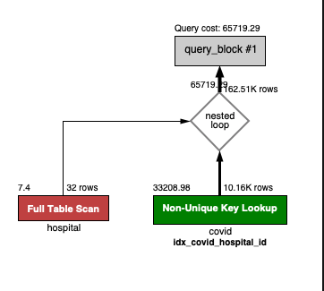
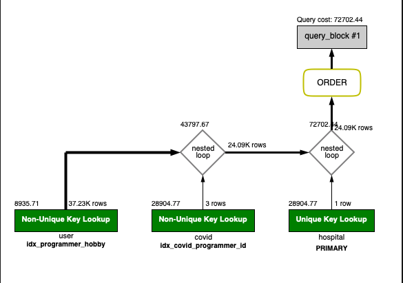
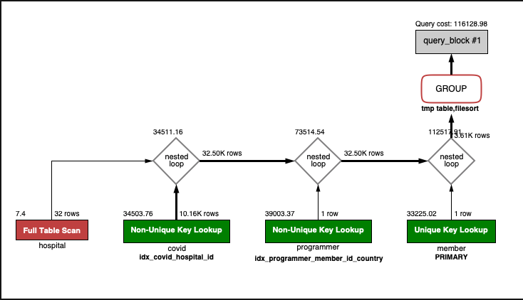
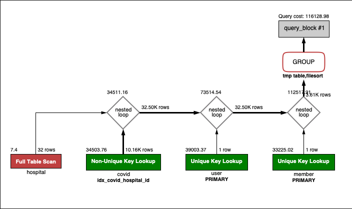

<p align="center">
    
</p>
<p align="center">
  
  
  <a href="https://edu.nextstep.camp/c/R89PYi5H" alt="nextstep atdd">
    
  </a>
  
</p>

<br>

# 인프라공방 샘플 서비스 - 지하철 노선도

<br>

## 🚀 Getting Started

### Install
#### npm 설치
```
cd frontend
npm install
```
> `frontend` 디렉토리에서 수행해야 합니다.

### Usage
#### webpack server 구동
```
npm run dev
```
#### application 구동
```
./gradlew clean build
```
<br>

## 미션

* 미션 진행 후에 아래 질문의 답을 작성하여 PR을 보내주세요.

### 1단계 - 화면 응답 개선하기
#### TODO List
- [x] 개선 전 성능 파악하기
  - [x] 테스트, 로컬개발, 운영 환경 프로퍼티 세팅
  - [x] 부하 테스트 해보기
- [x] reverse-proxy 개선해보기
- [x] was 개선해보기

1. 성능 개선 결과를 공유해주세요 (Smoke, Load, Stress 테스트 결과)

사용자가 가장 많이 사용할 거 같은 기능인 `지하철역 조회 -> 경로 탐색 시나리오`로 테스트 
* [Smoke 테스트 결과](./station-line-search/smoke/README.md)
* [Load 테스트 결과](./station-line-search/load/README.md)
* [Stress 테스트 결과](./station-line-search/stress/README.md)

2. 어떤 부분을 개선해보셨나요? 과정을 설명해주세요
### 1. reverse-proxy 개선
#### worker_connection 수정 
* 스트레스 테스트 중 vus 240 정도로 올라가면 was 에 특별한 error log 가 없이, reverse-proxy 단에서 클라이언트 요청 처리가 실패 했음
* nginx 가 요청을 처리 못하는거 같았음, 코어가 1개 짜리 서버이기 때문에 worker_process 개수를 늘리는건 의미 없다고 생각해서, worker_connection 를 수정함 
* 512 (default) -> 1024 로 늘렸더니 시스템이 버틸수 있는 최대 vus 가 420~430 대 까지 늘었음
* 1024 -> 2048 로 늘려봤더니 max vus 가 930~940 까지 늘었음, 대신 평균 응답속도가 work_connection 1024 때 보다 더 느려짐
* worker_connection 이 1024 개던, 2048 개던 rps 는 200 초반 정도 였음 __worker_connection 이 늘어난다고 rps 가 늘지 않는다__ 는 걸 알게됨. 
* 부하 테스트의 최대 vus 가 300 이라 worker_connection 를 1024 로 세팅함

#### keepalive 지시어 추가
* reverse-proxy <-> was 의 통신에 대한 리소스를 최소한으로 사용해 보려고 nginx 설정에 keepalive 지시어를 추가했음
* 미세한 성능 효과를 얻음, 15ms 정도의 응답속도가 줄음.

#### gzip, http2 적용
gzip, http2 둘 다 응답속도의 영향을 주지 않을 만큼 (오히려 더 떨어졌을때도 있었음) 효과가 없었음. 

### 2. web-application 개선
#### N+1 문제 수정
* 최단경로를 찾기 위해 Line 을 가져오고 (1) -> Line 에서 Section 을 가져온다 (23 번) 총 24 번의 쿼리가 날아감
* `spring.jpa.properties.hibernate.default_batch_fetch_size` 설정을 추가해 Line 에 연관된 Section 을 in query 로 한번에 가져온다.
* 스트레스 테스트 기준 820~830ms 에서 620~630ms 정도로 응답속도가 개선됨.
#### 자주 조회 되지만 잘 안바뀌는 데이터에 캐시 적용
* 지하철노선도 어플리케이션에서 지하철역 리스트와 지하철역 사이의 최단 경로 결과를 redis 에 캐시함
* 스트레스 테스트 기준 620~630ms 에서 200ms 정도로 응답속도가 개선됨. 

---

### 2단계 - 조회 성능 개선하기
- [x] 인덱스 적용 실습해보기
- [ ] 페이징 쿼리 추가하기
- [ ] 데이터베이스 이중화 해보기

1. 인덱스 적용해보기 실습을 진행해본 과정을 공유해주세요

### [Coding as a Hobby](https://insights.stackoverflow.com/survey/2018#developer-profile-_-coding-as-a-hobby) 와 같은 결과를 반환하세요.


```sql
select (count(id) / (select count(id) from subway.programmer) * 100) as 'percent'
from subway.programmer
group by hobby;

-- (Duration / Fetch Time)
-- 0.039 sec / 0.0000081 sec
```

1. programmer 테이블 PK 추가
2. hobby 컬럼 기준으로 정렬이 될 수 있도록 인덱스 추기

###프로그래머별로 해당하는 병원 이름을 반환하세요. (covid.id, hospital.name)



```sql
select covid.id, hospital.name
from subway.covid join
     subway.hospital on covid.hospital_id = hospital.id
WHERE covid.id >= 1000
    LIMIT 0, 10;

-- (Duration / Fetch Time)
-- 0.0020 sec / 0.0000079 sec
```

1. covid, hospital 테이블에 PK 추가
2. 페이징 쿼리와 where 절 적용

### 프로그래밍이 취미인 학생 혹은 주니어(0-2년)들이 다닌 병원 이름을 반환하고 user.id 기준으로 정렬하세요. (covid.id, hospital.name, user.Hobby, user.DevType, user.YearsCoding)



```sql
SELECT covid.id, hospital.name, user.hobby, user.dev_type, user.years_coding
FROM subway.programmer as user
	join subway.covid on user.id = covid.programmer_id
    join subway.hospital on covid.hospital_id = hospital.id
WHERE hobby = 'Yes' AND (student LIKE 'Yes%' OR years_coding = '0-2 years')
order by user.id
    limit 0, 10;

-- (Duration / Fetch Time)
-- 0.0019 sec / 0.000010 sec
```

1. programmer 의 조건 컬럼인 programmer.hobby 에 인덱스 추가, 각 테이블에 PK 추가
2. 조인 조건인 covid.programmer_id 에 인덱스 추가
3. fetch time 을 줄이기 위한 페이징 추가

## 서울대병원에 다닌 20대 India 환자들을 병원에 머문 기간별로 집계하세요. (covid.Stay)



```sql
select stay, count(member.id)
from subway.covid
    join subway.hospital on covid.hospital_id = hospital.id
    join subway.member on covid.member_id = member.id
    join subway.programmer on programmer.member_id = member.id
where hospital.name = '서울대병원'
  and age between 20 and 29
  and country = 'India'
group by stay;

-- (Duration / Fetch Time)
-- 0.034 sec / 0.0000091 sec
```

1. 조인 조건인 programmer.member_id, where 조건 중에 선택도가 높은 programmer.country 다중 컬럼 인덱스 추가
2. 조인 조건인 covid.hospital_id 에 인덱스 추가

## 서울대병원에 다닌 30대 환자들을 운동 횟수별로 집계하세요. (user.Exercise)



```sql
select exercise, count(member.id)
from subway.programmer as user
    join subway.covid on user.id = covid.programmer_id
    join subway.hospital on covid.hospital_id = hospital.id
    join subway.member on user.member_id = member.id
where hospital.name = '서울대병원'
  and member.age between 30 and 39
group by exercise;

-- (Duration / Fetch Time)
-- 0.092 sec / 0.0000069 sec
```

지금까지 추가한 인덱스 때문에, 따로 걸어준 인덱스는 없음 만약 인덱스가 없는 상황이라면, 조인 조건들의 인덱스와, member.age 에 인덱스를 고려해 볼 것이다.

2. 페이징 쿼리를 적용한 API endpoint를 알려주세요

